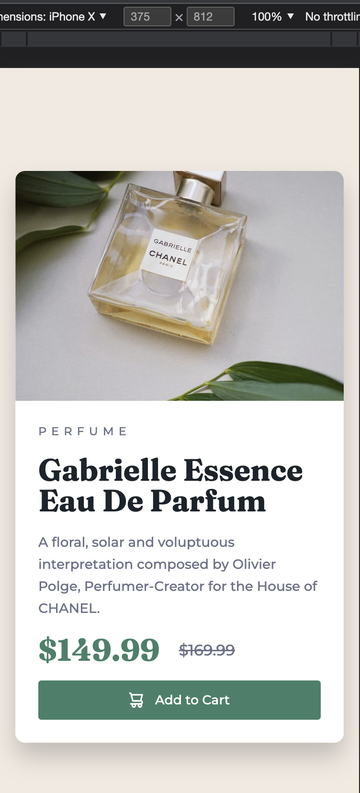
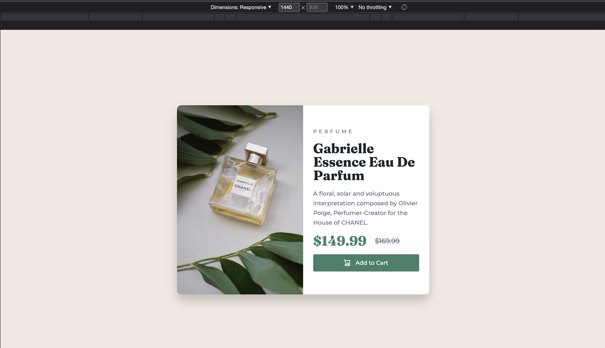
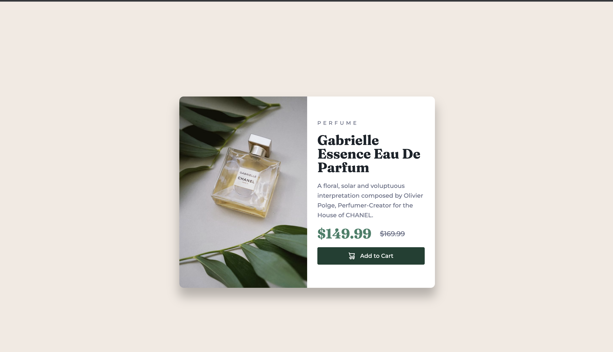

# Frontend Mentor - Product preview card component solution

This is a solution to the [Product preview card component challenge on Frontend Mentor](https://www.frontendmentor.io/challenges/product-preview-card-component-GO7UmttRfa). Frontend Mentor challenges help you improve your coding skills by building realistic projects.

## Table of contents

- [Overview](#overview)
  - [The challenge](#the-challenge)
  - [Screenshot](#screenshot)
  - [Links](#links)
- [My process](#my-process)
  - [Built with](#built-with)
  - [What I learned](#what-i-learned)
  - [Continued development](#continued-development)
  - [Useful resources](#useful-resources)
- [Author](#author)
- [Acknowledgments](#acknowledgments)

**Note: Delete this note and update the table of contents based on what sections you keep.**

## Overview

### The challenge

Users should be able to:

- View the optimal layout depending on their device's screen size
- See hover and focus states for interactive elements

### Screenshot

### Links

- Solution URL: [Add solution URL here](https://your-solution-url.com)
- Live Site URL: [Add live site URL here](https://your-live-site-url.com)

## My process

### Built with

- Semantic HTML5 markup
- CSS custom properties
- Flexbox
- CSS Grid
- Mobile-first workflow
- [React](https://reactjs.org/) - JS library
- [Styled Components](https://styled-components.com/) - For styles
- [Vite](https://vitejs.dev/) - For development

### What I learned

- Styled components have more flexibility and easy to reuse as they are components as well.
- Vite offers a faster development environment and lighter project files.

### Continued development

My next step is to continue learning about Separation of Concerns in React:

- What does that mean?
- Container components
- Presentational Components
- their corresponding usage.

### Useful resources

- [Stack Overflow](https://stackoverflow.com/) - Every developer's friend.
- [Google](https://www.google.com) - This is always a life a saver.
- [Styled Components](https://styled-components.com/) - Game changer in styling react components.
- [Vite](https://vitejs.dev/) - Is literally the next generation frontend tooling.

## Author

- Website - [hcmwebs](https://www.hcmwebs.com)
- Frontend Mentor - [@hcmwebs](https://www.frontendmentor.io/profile/Hcmwebs)
- Twitter - [@hcmwebs](https://www.twitter.com/hcmwebs)

## Acknowledgments

- [Frontend-mentor](https://www.frontendmentor.io/) - Thank you very much for creating this platform.
